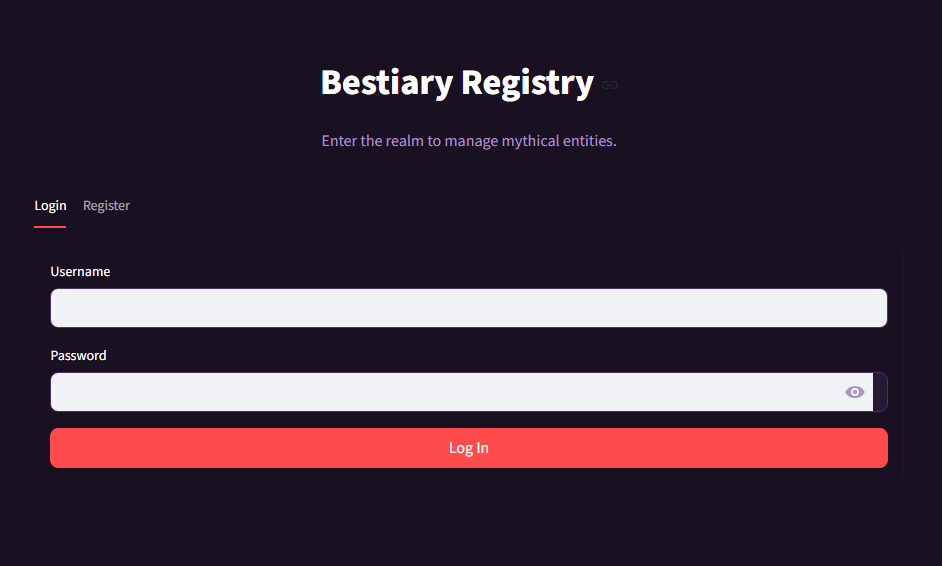
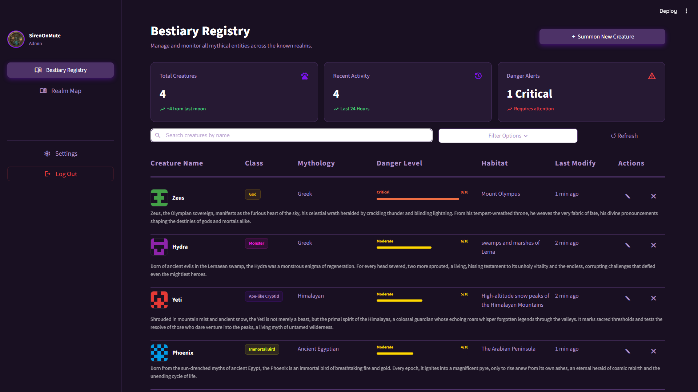
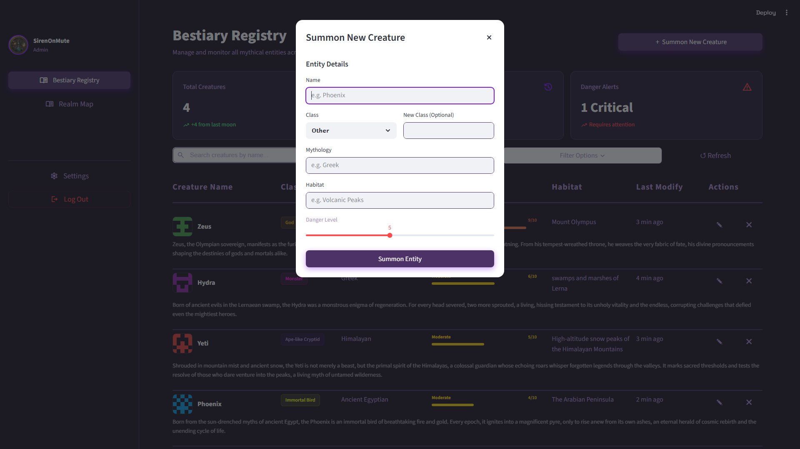
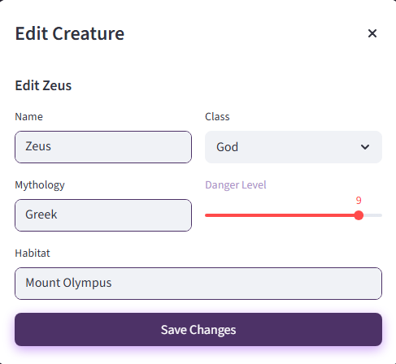
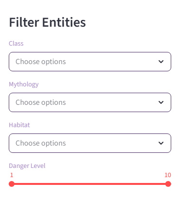
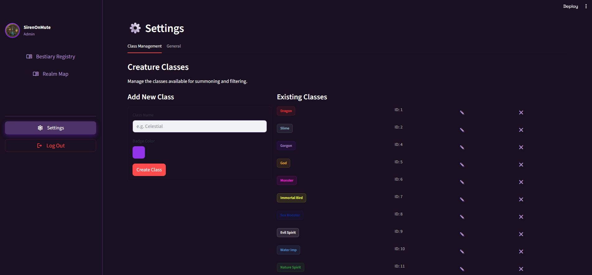
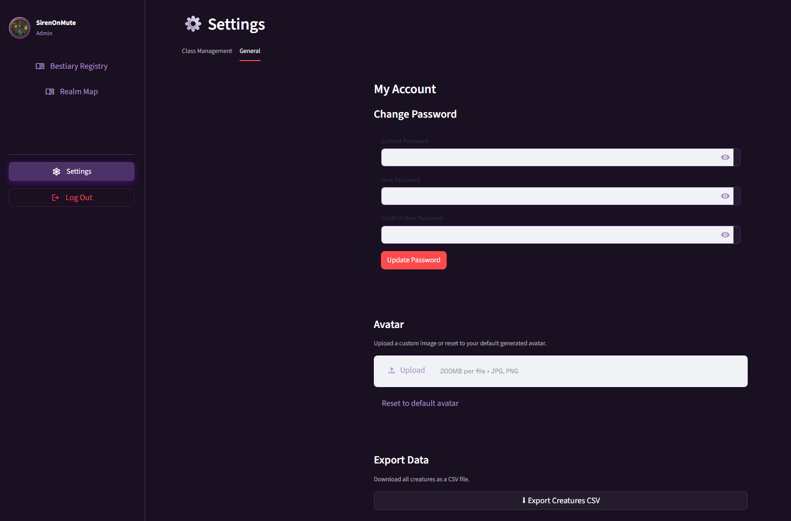

# 🐉 Bestiary Registry - Mythical Creature Management System


This project implements **EX1 (FastAPI Backend)**, **EX2 (Streamlit Frontend)**, and **EX3 (Orchestrated Microservices)**. It is a registry for managing a "Bestiary" of mythical creatures, allowing users to catalogue and view entities across different mythologies.
<div align="center">
  <a href="https://www.youtube.com/watch?v=lLU2ojBF8Ys">
    
  </a>
</div>

## Important Links

- **Backend (Render):** https://bestiary-registry.onrender.com
- **Frontend (Streamlit Cloud):** https://bestiary-registry.streamlit.app
- **API Documentation:** https://bestiary-registry.onrender.com/docs

## Backend

*   **FastAPI** backend with full CRUD support for creatures and classes.
*   **SQLite** via **SQLModel** for persistence, with additive column migrations on startup.
*   **JWT authentication** with bcrypt-hashed passwords and role-based access control (admin/viewer).
*   Lore generation enqueued asynchronously via **ARQ** on creature creation — no blocking the HTTP response.

## Frontend

*   Implemented using **Streamlit**.
*   Full CRUD workflows for creatures and classes via a custom dark-mode dashboard.
*   JWT session persisted in `st.query_params` so the session survives page refreshes.
*   Real-time name search, multi-faceted filtering, danger-level metrics, and CSV export.
*   Per-user avatar upload stored in the database and displayed in the sidebar.

---

## Application Showcase

### 1. Login and Authentication
Users can log in with their credentials, which are authenticated against the FastAPI backend. JWT tokens are stored in the URL query parameters to maintain session state across page refreshes.

<p align="center">

</p>

### 2. The Dashboard
The central command center for monitoring all registered entities. Features real-time metrics, a responsive data grid, and quick actions.

<p align="center">

</p>

### 3. Summoning New Entities
A streamlined workflow for adding new creatures to the registry.


<p align="center">
  
</p>


### 4. Entity Management (Editing)
Modify existing records with ease, updating attributes like Danger Level, Habitat, or Class as the lore evolves.

<p align="center">
  
</p>

### 5. Advanced Filtering
Drill down into the data using powerful multi-select filters for Class, Mythology, and Danger Level ranges.

<p align="center">
  
</p>

### 6. System Settings
Manage global configurations, including creature class management, avatar upload, and CSV export.

#### Creature Classes:

<p align="center">
  
</p>

#### General Settings:

<p align="center">
  
</p>

---

## Key Features

*   **FastAPI Backend**: Full CRUD API with auto-generated Swagger/OpenAPI documentation.
*   **JWT Authentication**: bcrypt-hashed passwords, HS256 tokens, role-based access (admin/viewer). Mutating endpoints require the `admin` role.
*   **Async Lore Generation**: On creature creation, a `generate_creature_lore_task` job is enqueued to Redis. The ARQ worker picks it up, calls the Gemini LLM, and writes the lore back to the database — without blocking the API response.
*   **Docker Compose Orchestration**: Three-service stack (backend, Redis, worker) with health checks and startup ordering.
*   **Persistent Storage**: SQLite with SQLModel ORM. Schema evolves via additive migrations — no `.db` files committed to git.
*   **Streamlit Frontend**: Custom CSS dark-mode UI with interactive dialogs, metrics, and real-time filtering.
*   **Real-Time Exploration**: Instant name search and multi-faceted filtering by class, mythology, habitat, and danger level.
*   **CSV Export**: Download the full creature registry as a CSV file from the Settings page.
*   **Avatars**: Auto-generated using DiceBear identicon API, stored as external URLs in the database.
*   **Realm Map**: Static map visualization page.
*   **Rate Limiting**: 100 requests per minute per IP via slowapi. `X-RateLimit-*` headers returned on creature list endpoint.

---

## Technology Stack

| Component | Technologies |
| :--- | :--- |
| **Backend** | Python 3.13, FastAPI, Uvicorn, SQLModel (Pydantic + SQLAlchemy) |
| **Frontend** | Streamlit 1.57, Requests, Custom CSS, `streamlit-keyup` |
| **Database** | SQLite (`creatures.db`), additive migrations via `PRAGMA table_info` |
| **Auth** | JWT (`python-jose`, HS256), bcrypt (`passlib`) |
| **Async Worker** | ARQ, Redis 7 |
| **LLM Microservice** | Google Gemini (`gemini-2.5-flash`, `google-genai` SDK) |
| **Orchestration** | Docker Compose (3 services: backend, redis, worker) |
| **Tooling** | `uv` (package management), pytest, ruff |

---

## 📂 Project Structure

```text
Bestiary-Registry/
├── compose.yaml                  # Three-service Docker Compose stack
├── README.md
├── backend/
│   ├── Dockerfile
│   ├── main.py                   # Uvicorn entry point
│   ├── pyproject.toml
│   ├── seed_classes.py           # Seeds 8 default creature classes (idempotent)
│   ├── update_classes.py         # Dev utility: randomise creature types
│   ├── creatures.http            # HTTP playground for manual API testing
│   ├── app/
│   │   ├── app.py                # FastAPI instance, lifespan, ARQ pool
│   │   ├── auth.py               # JWT creation, bcrypt, role dependency
│   │   ├── db.py                 # SQLite engine, migrations, default admin seed
│   │   ├── models.py             # SQLModel schemas: Creature, User, classes
│   │   ├── worker.py             # ARQ WorkerSettings, lore task, refresh task
│   │   ├── limiter.py            # slowapi rate limiter instance
│   │   ├── routers/
│   │   │   ├── auth.py           # POST /auth/token, GET /auth/me, PUT /auth/me/*
│   │   │   ├── creatures.py      # GET/POST/PUT/DELETE /creatures, CSV export
│   │   │   └── classes.py        # GET/POST/PUT/DELETE /classes
│   │   └── services/
│   │       ├── creatures.py      # CRUD logic, auto-avatar, timestamps
│   │       ├── classes.py        # CRUD logic, cascade rename
│   │       └── lore.py           # Gemini LLM call (gemini-2.5-flash)
│   └── tests/
│       ├── test_creatures.py
│       ├── test_creature_classes.py
│       ├── test_auth.py
│       ├── test_lore.py
│       ├── test_worker.py        # pytest.mark.anyio async worker tests
│       ├── test_export.py
│       └── test_health.py
├── frontend/
│   ├── dashboard.py              # Main Streamlit app
│   ├── auth.py                   # Login/register page
│   ├── sidebar.py                # Navigation + avatar display
│   ├── settings.py               # Class management, avatar upload, CSV export
│   ├── realm_map.py              # Static map page
│   ├── api_client.py             # HTTP client wrapper
│   ├── api_utils.py              # Cached API layer (2s TTL)
│   ├── style.css                 # Custom dark-theme CSS
│   ├── requirements.txt          # Standalone frontend deps
│   ├── pictures/                 # Screenshot assets for README
│   └── tests/
│       ├── test_dashboard.py
│       └── test_workflow.py
├── scripts/
│   ├── refresh.py                # Standalone creature refresh script (ARQ + Redis)
│   └── demo.sh                   # End-to-end demo script for graders
└── docs/
    ├── EX3-notes.md              # Architecture, Redis trace, JWT docs
    └── runbooks/
        └── compose.md            # Launch, health checks, CI instructions
```

---

## Quick Start

### Prerequisites

Copy `.env.example` to `.env` and fill in the required values:

```powershell
cp .env.example .env
```

Edit `.env` and set:
- `GEMINI_API_KEY` — get it from [Google AI Studio](https://aistudio.google.com/app/apikey)
- `SECRET_KEY` — generate with:
```powershell
 python -c "import secrets; print(secrets.token_hex(32))"
 ```


The other variables have sensible defaults for local Docker and don't need to be changed.

### Running the project

**Step 1 — Start all backend services** (API + Redis + Worker):
```powershell
docker compose up --build -d
docker compose ps  # verify all services are running
```

**Step 2 — Start the frontend** (open a new terminal):
```powershell
cd backend
uv run python -m streamlit run ../frontend/dashboard.py
# Dashboard available at http://localhost:8501
```

---

## API Documentation

With the backend running:

*   **Swagger UI**: [http://localhost:8000/docs](http://localhost:8000/docs)
*   **ReDoc**: [http://localhost:8000/redoc](http://localhost:8000/redoc)

Default admin credentials (seeded on first startup): `admin` / `admin123`

---

## Testing

```powershell
cd backend
uv run python -m pytest tests/ -v
```

Tests use FastAPI TestClient with an in-memory SQLite database — no running server or Redis required.

---

## Demo Script

Run the full end-to-end demo that walks through all major features:

```powershell
bash scripts/demo.sh
```

Prerequisites: Docker Compose must be running (`docker compose up -d`) before running the demo.

---

## Code Quality

```bash
cd backend
uv run ruff check .
uv run ruff format --check .
```

CI runs ruff, the full pytest suite, and Schemathesis API tests on every push to `main` (`.github/workflows/ci.yml`).

---

## AI Assistance

This project was developed with the assistance of **Claude** (Anthropic) as an AI pair-programming tool. Claude was used throughout the development process to:

- Scaffold and iterate on FastAPI endpoints, SQLModel schemas, and service logic.
- Design and debug the ARQ async worker, Redis idempotency pattern, and Docker Compose configuration.
- Build and refine the Streamlit frontend, including the JWT auth flow, dialog state management, and custom CSS theming.
- Write and extend the pytest test suite, including async worker tests using `pytest-anyio`.
- Author technical documentation (`docs/EX3-notes.md`, `docs/runbooks/compose.md`).

All generated code was reviewed, tested, and integrated by the developer. The final architecture, feature decisions, and submission are the developer's own work.
